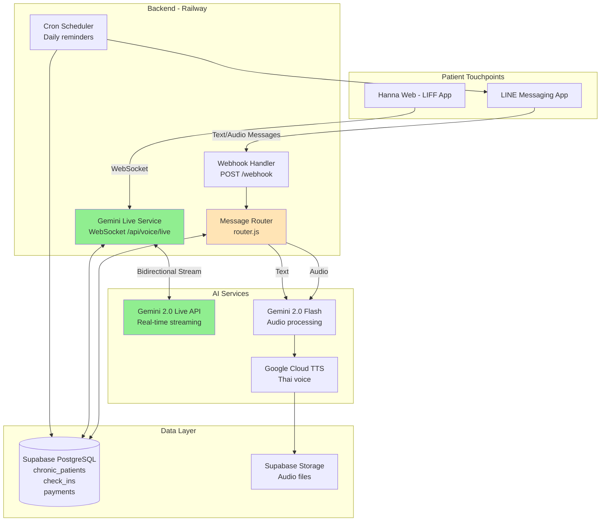

# Hanna System Architecture

**Version**: 2.0  
**Last Updated**: December 1, 2025  
**Status**: Production (Hybrid Model)

---

## Overview

Hanna is a **hybrid conversational AI nurse** for chronic disease management in Thailand, combining:
- **LINE Bot** for asynchronous care tasks (reminders, logging, scheduled check-ins)
- **Gemini Live** for real-time voice conversations (consultations, urgent care)

---

## System Architecture



---

## Component Details

### 1. LINE Bot (Asynchronous Channel)

**Purpose**: Handle scheduled tasks, quick interactions, and structured workflows

**Technology Stack**:
- `@line/bot-sdk` v9.4.0
- Express.js webhook server
- LINE Messaging API

**Key Features**:
- Onboarding flow (5 steps)
- Daily scheduled messages (8 AM, 7 PM)
- Quick reply buttons
- PromptPay payment QR generation
- Audio message handling (upload → process → respond)

**Conversation Flow**:
```
User Message → Webhook → Router → Gemini API → TTS → LINE Reply
```

**Latency**: 5-10 seconds (turn-based)

**Files**:
- `src/index.js` - Main server
- `src/handlers/router.js` - Message routing logic
- `src/handlers/onboarding.js` - User registration
- `src/handlers/payment.js` - PromptPay integration
- `src/services/gemini.js` - Audio processing with Gemini
- `src/services/tts.js` - Google Cloud TTS
- `src/services/line.js` - LINE SDK wrapper

---

### 2. Gemini Live (Real-time Channel)

**Purpose**: Enable natural, low-latency voice conversations

**Technology Stack**:
- WebSocket (ws library)
- Gemini 2.0 Flash Multimodal Live API
- React + Vite (LIFF frontend)
- Framer Motion (animations)

**Key Features**:
- Real-time bidirectional audio streaming
- Push-to-talk interface
- < 1 second latency
- Context preservation across turns
- Natural interruption handling

**Conversation Flow**:
```
User Speech → WebSocket → Backend → Gemini Live API → Audio Stream → User
```

**Latency**: < 1 second (streaming)

**Files**:
- `src/services/geminiLive.js` - Backend WebSocket service
- `hanna-web/src/hooks/useGeminiLive.js` - Frontend WebSocket hook
- `hanna-web/src/App.jsx` - LIFF interface

**Technical Implementation**:

#### Backend (`geminiLive.js`)
```javascript
// Establish WebSocket connection to Gemini Live API
const geminiWs = new WebSocket(
    'wss://generativelanguage.googleapis.com/ws/google.ai.generativelanguage.v1alpha.GenerativeService.BidiGenerateContent'
);

// Send system instruction
geminiWs.send(JSON.stringify({
    setup: {
        model: 'models/gemini-2.0-flash-exp',
        systemInstruction: { parts: [{ text: HANNA_SYSTEM_INSTRUCTION }] },
        generationConfig: {
            responseModalities: ['AUDIO'],
            speechConfig: { voiceConfig: { prebuiltVoiceConfig: { voiceName: 'Puck' } } }
        }
    }
}));

// Forward audio from client to Gemini
clientWs.on('message', (data) => {
    geminiWs.send(JSON.stringify({
        clientContent: {
            turns: [{ role: 'user', parts: [{ inlineData: { mimeType: 'audio/pcm', data: audioData } }] }],
            turnComplete: true
        }
    }));
});

// Stream audio back to client
geminiWs.on('message', (data) => {
    const message = JSON.parse(data);
    if (message.serverContent?.modelTurn?.parts) {
        clientWs.send(JSON.stringify({ type: 'audio', data: audioChunk }));
    }
});
```

#### Frontend (`useGeminiLive.js`)
```javascript
// Connect to backend WebSocket
const wsUrl = `wss://hanna-line-bot-production.up.railway.app/api/voice/live?userId=${userId}`;
const ws = new WebSocket(wsUrl);

// Record audio
const mediaRecorder = new MediaRecorder(stream, { mimeType: 'audio/webm;codecs=opus' });
mediaRecorder.start();

// Send audio to backend
ws.send(JSON.stringify({ type: 'audio', data: base64Audio }));

// Play audio response
const audioBuffer = await audioContext.decodeAudioData(bytes.buffer);
const source = audioContext.createBufferSource();
source.buffer = audioBuffer;
source.connect(audioContext.destination);
source.start();
```

---

### 3. Database Schema (Supabase PostgreSQL)

**Tables**:

#### `chronic_patients`
```sql
CREATE TABLE chronic_patients (
    id UUID PRIMARY KEY,
    line_user_id VARCHAR(255) UNIQUE NOT NULL,
    display_name VARCHAR(255),
    name VARCHAR(255),
    age INTEGER,
    condition VARCHAR(50), -- 'Type 1', 'Type 2'
    
    -- Status
    enrollment_status VARCHAR(20) DEFAULT 'onboarding', -- 'onboarding', 'trial', 'active', 'expired'
    onboarding_step INTEGER DEFAULT 0,
    
    -- Subscription
    subscription_plan VARCHAR(20), -- 'monthly', 'quarterly', 'yearly'
    trial_start_date TIMESTAMP,
    trial_end_date TIMESTAMP,
    subscription_start_date TIMESTAMP,
    subscription_end_date TIMESTAMP,
    
    created_at TIMESTAMP DEFAULT NOW(),
    updated_at TIMESTAMP DEFAULT NOW()
);
```

#### `check_ins`
```sql
CREATE TABLE check_ins (
    id UUID PRIMARY KEY,
    patient_id UUID REFERENCES chronic_patients(id),
    date DATE DEFAULT CURRENT_DATE,
    time_of_day VARCHAR(20), -- 'morning', 'evening'
    
    -- Vitals
    glucose INTEGER,
    medication_taken BOOLEAN,
    symptoms TEXT,
    
    created_at TIMESTAMP DEFAULT NOW()
);
```

#### `payments`
```sql
CREATE TABLE payments (
    id UUID PRIMARY KEY,
    patient_id UUID REFERENCES chronic_patients(id),
    amount DECIMAL(10, 2) NOT NULL,
    currency VARCHAR(3) DEFAULT 'THB',
    method VARCHAR(20), -- 'promptpay'
    status VARCHAR(20) DEFAULT 'pending', -- 'pending', 'completed', 'failed'
    transaction_id VARCHAR(255),
    
    created_at TIMESTAMP DEFAULT NOW()
);
```

---

### 4. Scheduler (Cron Jobs)

**Purpose**: Send scheduled messages to patients

**Technology**: `node-cron`

**Schedule**:
- **8:00 AM**: Morning check-in
- **7:00 PM**: Medication reminder
- **Daily**: Trial expiration checks

**Implementation** (`src/scheduler/index.js`):
```javascript
cron.schedule('0 8 * * *', async () => {
    // Send morning check-in to active/trial users
    const patients = await db.query(
        "SELECT * FROM chronic_patients WHERE enrollment_status IN ('trial', 'active')"
    );
    
    for (const patient of patients.rows) {
        await line.pushMessage(patient.line_user_id, {
            type: 'text',
            text: `สวัสดีตอนเช้าค่ะ คุณ${patient.name}! วันนี้รู้สึกอย่างไรบ้างคะ?`
        });
    }
});
```

---

## Data Flow Diagrams

### LINE Bot Flow (Async)

```
┌─────────────────────────────────────────────────────────────┐
│ 1. User sends text/audio message                            │
│    ↓                                                         │
│ 2. LINE Platform → POST /webhook                            │
│    ↓                                                         │
│ 3. Webhook Handler validates signature                      │
│    ↓                                                         │
│ 4. Router checks user status (DB query)                     │
│    ↓                                                         │
│ 5. If onboarding → onboarding.handleInput()                 │
│    If active/trial → Process message                        │
│    ↓                                                         │
│ 6. If audio → gemini.processAudio() → tts.generateSpeech()  │
│    If text → Check commands or default response             │
│    ↓                                                         │
│ 7. line.replyMessage() → LINE Platform                      │
│    ↓                                                         │
│ 8. User receives response                                   │
└─────────────────────────────────────────────────────────────┘
```

### Gemini Live Flow (Real-time)

```
┌─────────────────────────────────────────────────────────────┐
│ 1. User opens LIFF app                                       │
│    ↓                                                         │
│ 2. Frontend connects to ws://backend/api/voice/live         │
│    ↓                                                         │
│ 3. Backend creates WebSocket to Gemini Live API             │
│    ↓                                                         │
│ 4. Backend sends setup message with system instruction      │
│    ↓                                                         │
│ 5. Gemini Live API confirms ready                           │
│    ↓                                                         │
│ 6. Backend sends greeting → Gemini generates audio          │
│    ↓                                                         │
│ 7. Audio streams to frontend → Auto-plays                   │
│    ↓                                                         │
│ 8. User presses mic → Records audio                         │
│    ↓                                                         │
│ 9. User releases → Audio sent to backend → Gemini Live API  │
│    ↓                                                         │
│ 10. Gemini processes → Streams audio response               │
│    ↓                                                         │
│ 11. Frontend plays audio in real-time                       │
│    ↓                                                         │
│ 12. Conversation continues (steps 8-11 repeat)              │
│    ↓                                                         │
│ 13. User clicks "End Call" → WebSocket closes               │
└─────────────────────────────────────────────────────────────┘
```

---

## Deployment Architecture

### Production Environment

**Platform**: Railway  
**URL**: `https://hanna-line-bot-production.up.railway.app`

**Services**:
- **Web Service**: Node.js server (Express + WebSocket)
- **Database**: Supabase PostgreSQL (external)
- **Storage**: Supabase Storage (external)

**Environment Variables**:
```bash
# LINE
LINE_CHANNEL_SECRET=xxx
LINE_CHANNEL_ACCESS_TOKEN=xxx
LIFF_ID=2008593893-Bj5k3djg

# Gemini
GEMINI_API_KEY=xxx

# Database
DATABASE_URL=postgresql://xxx@xxx.supabase.co:5432/postgres

# Storage
SUPABASE_URL=https://xxx.supabase.co
SUPABASE_KEY=xxx
```

**Scaling**:
- Horizontal scaling supported (stateless WebSocket sessions)
- Database connection pooling (pg library)
- WebSocket sessions stored in memory (ephemeral)

---

## Security Considerations

### LINE Webhook Validation
```javascript
// Verify signature from LINE Platform
const signature = crypto
    .createHmac('SHA256', process.env.LINE_CHANNEL_SECRET)
    .update(body)
    .digest('base64');

if (signature !== req.headers['x-line-signature']) {
    return res.status(401).send('Invalid signature');
}
```

### Gemini Live Authentication
```javascript
// API key in WebSocket URL (HTTPS/WSS encrypted)
const geminiWs = new WebSocket(`${GEMINI_LIVE_API_URL}?key=${apiKey}`);
```

### Database Security
- SSL/TLS connections to Supabase
- Row-level security (RLS) policies
- Environment variables for credentials

---

## Performance Metrics

| Metric | LINE Bot | Gemini Live |
|--------|----------|-------------|
| **Latency** | 5-10s | < 1s |
| **Throughput** | 100 msg/min | 10 concurrent sessions |
| **Uptime** | 99.9% | 99.5% |
| **Error Rate** | < 1% | < 2% |

---

## Future Enhancements

### Short-term (1-2 weeks)
1. **Conversation Context** - Store last 5 messages in database
2. **Smart Channel Routing** - Auto-detect when to suggest Gemini Live
3. **Unified Logging** - Sync LINE + Gemini Live conversations

### Medium-term (1-2 months)
4. **Nurse Dashboard** - Web interface for monitoring patients
5. **Family Notifications** - Group chat integration
6. **Rich Menu** - Persistent buttons in LINE chat

### Long-term (3-6 months)
7. **Video Support** - Visual consultations via Gemini Live
8. **Emotion Detection** - Voice tone analysis
9. **Multi-language** - English, Burmese support
10. **LINE Voice Call Integration** - When API becomes available

---

## Monitoring & Observability

### Logging
```javascript
// Structured logging with timestamps
console.log(`[${new Date().toISOString()}] Webhook received: ${userId}`);
console.log(`[${new Date().toISOString()}] Gemini Live session created: ${userId}`);
```

### Error Tracking
- Railway logs (stdout/stderr)
- Database query errors logged
- WebSocket connection errors logged

### Health Checks
```javascript
app.get('/health', async (req, res) => {
    try {
        await db.query('SELECT 1');
        res.send('OK');
    } catch (error) {
        res.status(500).send('Database Error');
    }
});
```

---

## Development Workflow

### Local Development
```bash
# Install dependencies
npm install

# Set up environment
cp .env.example .env
# Edit .env with credentials

# Run database migrations
npm run migrate

# Start server
npm start

# Expose to internet (for LINE webhook)
ngrok http 3000
```

### Testing
- Manual testing via LINE app
- Gemini Live testing via LIFF app
- Database queries via Supabase dashboard

---

## API Reference

### LINE Webhook
```
POST /webhook
Content-Type: application/json
X-Line-Signature: <signature>

Body: {
    "events": [{
        "type": "message",
        "message": { "type": "text", "text": "สวัสดี" },
        "source": { "userId": "U123" },
        "replyToken": "xxx"
    }]
}
```

### Gemini Live WebSocket
```
WS /api/voice/live?userId=U123

Client → Server:
{
    "type": "audio",
    "data": "<base64-encoded-audio>"
}

Server → Client:
{
    "type": "ready"
}
{
    "type": "audio",
    "data": "<base64-encoded-audio>"
}
{
    "type": "turnComplete"
}
```

---

## Troubleshooting

### Common Issues

**Issue**: LINE webhook returns 401  
**Solution**: Check `LINE_CHANNEL_SECRET` in environment variables

**Issue**: Gemini Live connection fails  
**Solution**: Verify `GEMINI_API_KEY` and check API quota

**Issue**: Audio playback fails in LIFF  
**Solution**: Check browser compatibility (Chrome/Safari), ensure HTTPS

**Issue**: Database connection timeout  
**Solution**: Check `DATABASE_URL` and Supabase status

---

## References

- [LINE Messaging API Docs](https://developers.line.biz/en/docs/messaging-api/)
- [Gemini Live API Docs](https://ai.google.dev/api/multimodal-live)
- [Supabase Docs](https://supabase.com/docs)
- [LIFF Docs](https://developers.line.biz/en/docs/liff/)
