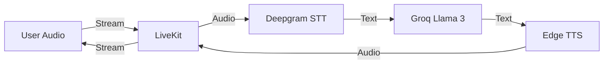

# Hanna System Architecture

**Version**: 2.1 (The Pivot)
**Last Updated**: December 15, 2025
**Status**: Production (Hybrid Intelligence Network)

---

## Overview

Hanna is a **hybrid intelligence network** for chronic disease management in Thailand, combining:
- **OneBrain Intelligence**: A centralized Risk Engine (Groq Llama 3) that audits patient health.
- **LINE Bot**: For asynchronous daily check-ins and "Active Nudge" reminders.
- **Hanna Voice**: Real-time voice conversations via LiveKit + EdgeTTS.
- **Nurse Dashboard**: A priority-based control center for human supervision.

---

## System Architecture

```mermaid
graph TB
    subgraph "Patient Touchpoints"
        LINE[LINE Messaging App]
        LIFF[Hanna Web - LIFF App]
    end
    
    subgraph "The Brain (OneBrain Service)"
        ROUTER[Message Router<br/>router.js]
        ONEBRAIN[Risk Engine<br/>OneBrain.js]
        SCHEDULER[Cron Scheduler<br/>Active Nudge]
    end
    
    subgraph "Cloud Services"
        LIVEKIT[LiveKit Cloud<br/>WebRTC Audio]
        GROQ[Groq Cloud<br/>Llama 3 (Reasoning)]
        EDGETTS[Microsoft Edge TTS<br/>Premwadee (Voice)]
    end
    
    subgraph "Data Layer"
        SUPABASE[(Supabase PostgreSQL<br/>patient_state<br/>nurse_tasks<br/>nurse_logs)]
    end
    
    subgraph "Nurse Control"
        DASH[Nurse Dashboard<br/>React + Tailwind]
    end
    
    LINE -->|Text| ROUTER
    LIFF <-->|WebRTC Voice| LIVEKIT
    
    ROUTER --> ONEBRAIN
    SCHEDULER --> ONEBRAIN
    ONEBRAIN --> SUPABASE
    
    ONEBRAIN -->|Risk Score| DASH
    DASH -->|Resolve Task| SUPABASE
    
    LIVEKIT -->|Audio Stream| LIFF
    ONEBRAIN -->|Context| GROQ
    GROQ -->|Response| EDGETTS
    EDGETTS -->|Audio| LIVEKIT
```

---

## Component Details

### 1. The Interface: LINE Bot (Asynchronous)

**Purpose**: "The Invisible App". Handles daily check-ins and safety alerts.
**Key Features**:
- **Smart Router**: Detects "Chest Pain" → Immediate 1669 Protocol.
- **Active Nudge**: Proactively calls (Push Message) silent patients.
- **Payments**: PromptPay integration.

### 2. The Engine: OneBrain + Hanna Voice

**Purpose**: To understand context and speak naturally.
**Technology Stack**:
- **Intelligence**: Groq (Llama 3.3 70B) - fast, medical reasoning.
- **Voice**: EdgeTTS (Neural Thai "Premwadee") + LiveKit (WebRTC).
- **Latency**: < 2 seconds end-to-end.

**Voice Flow**:
1. User Speaks → LiveKit (STT)
2. Text → Groq (Reasoning)
3. AI Text → EdgeTTS (Audio)
4. Audio → LiveKit (Playback)

### 3. The Control: Nurse Dashboard

**Purpose**: "Exception Management".
**Technology**: React, Tailwind, Supabase Real-time.
**Workflow**:
1. **OneBrain** creates a Task (Critical/High).
2. **Dashboard** flashes Red.
3. **Nurse** clicks 'Call' or 'Resolve'.
4. **Loop Closed**.

---

## Database Schema (Supabase)

### `patient_state` (The Brain's Memory)
Stores the current risk snapshot.
```sql
CREATE TABLE patient_state (
    patient_id UUID PRIMARY KEY,
    current_risk_score INTEGER, -- 0-10
    risk_level VARCHAR(20), -- 'critical', 'high', 'medium', 'low'
    risk_reasoning JSONB, -- {"triggers": ["bp_high_3days", "keyword_chest_pain"]}
    last_interaction TIMESTAMP
);
```

### `vitals_log` (The Data)
```sql
CREATE TABLE vitals_log (
    id UUID PRIMARY KEY,
    patient_id UUID REFERENCES chronic_patients(id),
    type VARCHAR(20), -- 'bp', 'glucose', 'weight', 'o2'
    value JSONB, -- {"systolic": 120, "diastolic": 80} or {"level": 110}
    source VARCHAR(20), -- 'manual_text', 'voice_ai', 'device'
    timestamp TIMESTAMP DEFAULT NOW()
);
```

### `medication_log` (The Adherence)
```sql
CREATE TABLE medication_log (
    id UUID PRIMARY KEY,
    patient_id UUID REFERENCES chronic_patients(id),
    med_name VARCHAR(100),
    taken BOOLEAN,
    reason_skipped TEXT,
    timestamp TIMESTAMP DEFAULT NOW()
);
```

### `audit_log` (The Legal Safety Net)
**CRITICAL**: Immutable log of all risk calculations and alerts.
```sql
CREATE TABLE audit_log (
    id UUID PRIMARY KEY,
    timestamp TIMESTAMP DEFAULT NOW(),
    actor VARCHAR(50), -- 'OneBrain', 'Nurse_A', 'Patient'
    action VARCHAR(50), -- 'CALCULATE_RISK', 'TRIGGER_ALARM', 'RESOLVE_TASK'
    patient_id UUID,
    details JSONB -- Snapshot of input/output for reproducibility
);
```

### `nurse_tasks` (The Queue)
Stores actionable items for the dashboard.
```sql
CREATE TABLE nurse_tasks (
    id UUID PRIMARY KEY,
    patient_id UUID REFERENCES chronic_patients(id),
    priority VARCHAR(20), -- 'critical', 'high', 'medium'
    status VARCHAR(20), -- 'pending', 'completed', 'escalated'
    reason TEXT, -- Human readable summary
    context JSONB, -- {"recent_vitals": ..., "history": ...}
    dismissal_reason VARCHAR(50), -- 'called_stable', 'false_positive'
    escalation_level INTEGER DEFAULT 0, -- 0=None, 1=Nurse, 2=Supervisor, 3=Director
    created_at TIMESTAMP DEFAULT NOW()
);
```

---

## 🛡️ Reliability & Safety Layer

### Failure Modes & Fallbacks
| Component | Failure Scenario | Automated Fallback |
|-----------|------------------|-------------------|
| **OneBrain (Groq)** | API Timeout / 500 | **Rule-Based Triage**: Fallback to Keyword Matching (Regex) for Safety. |
| **LiveKit Voice** | Connection Dropped | **SMS Failover**: "Call failed. Please type your symptoms." + High Priority Task. |
| **Supabase DB** | Timeout / Down | **Redis Queue**: Cache vital logs and retry sync when DB returns. |
| **Nurse Dashboard** | Offline / Unreachable | **SMS Broadcast**: Send critical alerts directly to Nurse Supervisor phone. |

### Safeguards (Alert Fatigue)
*   **Cap**: Max 15 **CRITICAL** tasks visible at any time.
*   **De-duplication**: Same patient = Max 1 task per 4 hours (unless new **Emergency Keyword**).
*   **Feedback Loop**: If Nurse marks >40% of tasks as "False Alarm", system auto-notifies Admin to retune OneBrain.

### Escalation Protocol
*   **T+0m**: Task Created on Dashboard (Sound Alert).
*   **T+60m**: Unresolved? **Ping Nurse** (Dashboard Flash).
*   **T+120m**: Still Unresolved? **SMS Supervisor**.
*   **T+180m**: Critical Failure. **SMS Clinical Director** + Incident Log.

---

## 🏗️ Updated Voice Stack (STT/TTS)



---

## Deployment Env Variables

```bash
# LINE
LINE_CHANNEL_SECRET=xxx
LINE_CHANNEL_ACCESS_TOKEN=xxx
LIFF_ID=xxx

# BRAIN
GROQ_API_KEY=xxx
DEEPGRAM_API_KEY=xxx # New for STT

# VOICE
LIVEKIT_API_KEY=xxx
LIVEKIT_API_SECRET=xxx
LIVEKIT_URL=wss://hanna.livekit.cloud

# DATA
DATABASE_URL=postgresql://xxx
```
