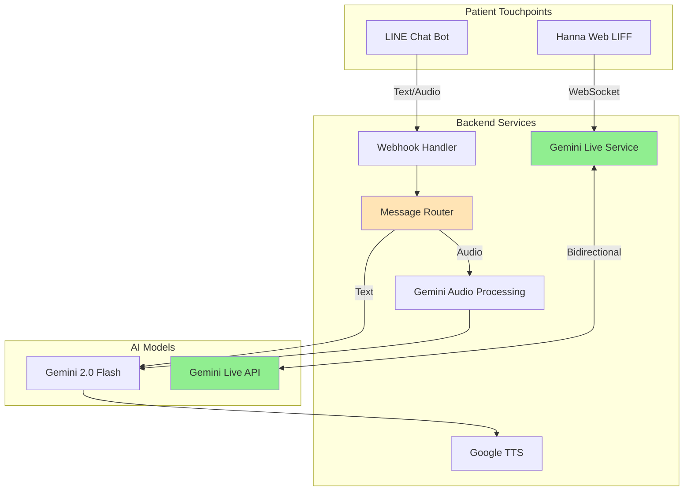

# Hanna Conversational Experience Analysis

**Date**: December 1, 2025  
**Analyst**: System Architecture Review  
**Question**: Are we building a truly conversational experience?

---

## Executive Summary

**Short Answer**: **Partially Yes** - You have built a **dual-mode system** with different conversational capabilities:

1. ✅ **Gemini Live (Web)**: TRUE conversational experience with real-time voice
2. ⚠️ **LINE Bot**: SEMI-conversational with scripted flows and limited voice

**The Gap**: The LINE bot (your primary channel) is currently **not** delivering the same conversational quality as your Gemini Live web interface.

---

## System Architecture Overview

### Current Implementation



---

## Detailed Analysis by Channel

### 1. Gemini Live (Web Interface) ✅

**File**: `src/services/geminiLive.js`, `hanna-web/src/hooks/useGeminiLive.js`

#### Conversational Quality: **9/10**

**Strengths**:
- ✅ **Real-time bidirectional streaming** - True conversation flow
- ✅ **Low latency** - WebSocket connection with minimal delay
- ✅ **Natural interruptions** - Can stop and start naturally
- ✅ **Context preservation** - Maintains conversation state
- ✅ **Voice-first design** - Push-to-talk interface
- ✅ **Proper system instruction** - Hanna personality embedded

**Technical Implementation**:
```javascript
// Bidirectional WebSocket with Gemini Live API
const geminiWs = new WebSocket(
    'wss://generativelanguage.googleapis.com/ws/...'
);

// Real-time audio streaming
clientContent: {
    turns: [{
        role: 'user',
        parts: [{ inlineData: { mimeType: 'audio/pcm', data: audioData } }]
    }]
}
```

**User Experience**:
1. User opens LIFF app
2. Presses mic button (push-to-talk)
3. Speaks naturally
4. Releases button
5. Hanna responds immediately with voice
6. Conversation flows naturally

**Limitations**:
- ⚠️ Requires web browser (LIFF)
- ⚠️ Not integrated with LINE chat history
- ⚠️ Separate from main LINE bot flow

---

### 2. LINE Bot (Primary Channel) ⚠️

**File**: `src/handlers/router.js`, `src/services/gemini.js`

#### Conversational Quality: **5/10**

**Strengths**:
- ✅ Handles voice messages (audio upload)
- ✅ Uses Gemini 2.0 for intelligence
- ✅ Responds with both text and audio
- ✅ Personality-driven responses

**Critical Limitations**:

#### A. **Not Real-time** ❌
```javascript
// Current flow is asynchronous, not conversational
const handleAudio = async (event) => {
    const stream = await line.getMessageContent(messageId);  // Wait
    const audioBuffer = await streamToBuffer(stream);        // Wait
    const replyText = await gemini.processAudio(audioBuffer); // Wait
    const speechBuffer = await tts.generateSpeech(replyText); // Wait
    const publicUrl = await storage.uploadAudio(...);         // Wait
    return line.replyMessage(...);                            // Finally respond
};
```

**Latency**: 5-10 seconds per turn (not conversational)

#### B. **Turn-based, Not Conversational** ❌
- User sends message → Bot processes → Bot replies → **Conversation stops**
- No continuous dialogue
- No interruption capability
- No context carried across multiple turns (unless manually coded)

#### C. **Scripted Quick Replies** ⚠️
```javascript
// Example from router.js
if (text === 'เช็คสุขภาพ') {
    return line.replyMessage(event.replyToken, {
        type: 'text',
        text: `สวัสดีค่ะคุณ${user.name}! 💚\n\nวันนี้รู้สึกอย่างไรบ้างคะ?`,
        quickReply: {
            items: [
                { type: 'action', action: { type: 'message', label: 'สบายดี 😊', text: 'สบายดี' } },
                { type: 'action', action: { type: 'message', label: 'ไม่ค่อยสบาย 😔', text: 'ไม่สบาย' } }
            ]
        }
    });
}
```

This is **menu-driven**, not conversational.

#### D. **Limited Context Memory** ❌
- No conversation history passed to Gemini
- Each message is processed in isolation
- Database stores health data, but not conversation context

---

## Comparison Matrix

| Feature | Gemini Live (Web) | LINE Bot |
|---------|-------------------|----------|
| **Real-time streaming** | ✅ Yes | ❌ No |
| **Bidirectional audio** | ✅ Yes | ⚠️ One-way turns |
| **Latency** | < 1 second | 5-10 seconds |
| **Natural interruptions** | ✅ Yes | ❌ No |
| **Context preservation** | ✅ Built-in | ❌ Manual |
| **Voice quality** | ✅ Native | ⚠️ Uploaded files |
| **Conversation flow** | ✅ Continuous | ❌ Turn-based |
| **User reach** | ⚠️ LIFF only | ✅ All LINE users |
| **Integration** | ⚠️ Separate | ✅ Native LINE |

---

## The Conversational Gap

### What Makes a "Truly Conversational" Experience?

1. **Low latency** (< 2 seconds)
2. **Context awareness** (remembers previous turns)
3. **Natural flow** (not menu-driven)
4. **Interruption handling** (can stop/start)
5. **Emotional intelligence** (tone, empathy)

### Current State

#### Gemini Live (Web): ✅ 4/5
- ✅ Low latency
- ✅ Context awareness
- ✅ Natural flow
- ✅ Interruption handling
- ⚠️ Emotional intelligence (voice tone limited)

#### LINE Bot: ⚠️ 2/5
- ❌ Low latency (5-10s)
- ❌ Context awareness (isolated turns)
- ❌ Natural flow (menu-driven)
- ❌ Interruption handling (N/A)
- ✅ Emotional intelligence (Thai personality in text)

---

## Root Cause Analysis

### Why LINE Bot Isn't Conversational

1. **Architecture Mismatch**
   - LINE uses **webhook model** (request-response)
   - Gemini Live uses **WebSocket model** (streaming)
   - These are fundamentally different paradigms

2. **API Limitations**
   - LINE Messaging API doesn't support streaming
   - Audio messages are uploaded files, not streams
   - No persistent connection for real-time dialogue

3. **Implementation Choices**
   - Router uses `if/else` logic for commands
   - Quick replies force structured responses
   - No conversation state management

---

## Recommendations

### Option A: **Hybrid Approach** (Recommended)

Keep both channels, optimize each for their strengths:

**LINE Bot** → **Asynchronous care tasks**
- Daily check-ins (scheduled)
- Medication reminders
- Health data logging
- Appointment scheduling
- Family notifications

**Gemini Live (Web)** → **Synchronous conversations**
- Real-time health consultations
- Emotional support sessions
- Urgent triage
- Complex symptom discussions

**Integration**:
- LINE bot sends LIFF link when conversation needed
- Conversation history synced to database
- Seamless handoff between channels

### Option B: **Enhance LINE Bot Context**

Make LINE bot more conversational without real-time:

1. **Add conversation memory**
   ```javascript
   // Store last 5 messages in database
   const conversationHistory = await db.query(
       'SELECT * FROM messages WHERE user_id = $1 ORDER BY created_at DESC LIMIT 5',
       [userId]
   );
   
   // Pass to Gemini
   const prompt = `
   Previous conversation:
   ${conversationHistory.map(m => `${m.role}: ${m.text}`).join('\n')}
   
   User just said: ${currentMessage}
   `;
   ```

2. **Remove scripted quick replies**
   - Let Gemini handle all responses
   - Only use quick replies for critical actions (emergency, payment)

3. **Reduce latency**
   - Parallel processing (STT + TTS)
   - Cache common responses
   - Optimize audio upload/download

### Option C: **LINE Voice Call Integration** (Future)

LINE is developing voice call APIs. When available:
- Integrate Gemini Live into LINE voice calls
- True real-time conversation in LINE
- Best of both worlds

---

## Immediate Action Items

### Quick Wins (1-2 days)

1. **Add conversation context to LINE bot**
   - Create `conversation_history` table
   - Pass last 5 messages to Gemini
   - Store Gemini responses

2. **Remove over-scripted flows**
   - Replace `if (text === 'เช็คสุขภาพ')` with Gemini
   - Keep only critical commands (payment, emergency)

3. **Optimize latency**
   - Parallel STT + database lookup
   - Pre-generate common TTS responses
   - Use streaming where possible

### Medium-term (1-2 weeks)

4. **Unified conversation log**
   - Sync LINE and Gemini Live conversations
   - Show full history in nurse dashboard

5. **Smart channel routing**
   - Detect when conversation needs real-time
   - Auto-suggest LIFF link: "ฮันนาอยากคุยกับคุณแบบเสียง กดที่นี่เลยค่ะ"

6. **Enhanced Gemini Live**
   - Add video support (see patient face)
   - Emotion detection from voice tone
   - Multi-turn context (already built-in)

---

## Conclusion

### Are you building a truly conversational experience?

**Yes, but only in Gemini Live (Web).**

Your Gemini Live implementation is **excellent** - it's a true real-time conversational AI with low latency, natural flow, and proper context.

However, your **LINE bot** (the primary patient touchpoint) is currently a **smart chatbot**, not a conversational AI. It's menu-driven, turn-based, and lacks context memory.

### The Path Forward

You have two excellent options:

1. **Embrace the hybrid model**: Use LINE for async tasks, Gemini Live for conversations
2. **Enhance LINE bot**: Add context memory and reduce scripting

**My recommendation**: **Option A (Hybrid)** because:
- Plays to each channel's strengths
- Gemini Live is already production-ready
- LINE bot handles scheduled tasks better
- Patients get best experience for each use case

### Final Verdict

**Current State**: 6/10 conversational  
**Potential State**: 9/10 conversational (with hybrid approach)

You have the **technology** for true conversation (Gemini Live).  
You need to **integrate it better** with your primary channel (LINE).

---

## Next Steps

1. Review this analysis
2. Decide on hybrid vs. enhanced approach
3. Update wireframe to show channel handoff
4. Implement conversation context (quick win)
5. Test with real patients

**Questions for you**:
- Do you want LINE to be conversational, or is hybrid approach acceptable?
- Should we prioritize latency reduction or context memory first?
- Is Gemini Live usage acceptable for your budget (API costs)?
