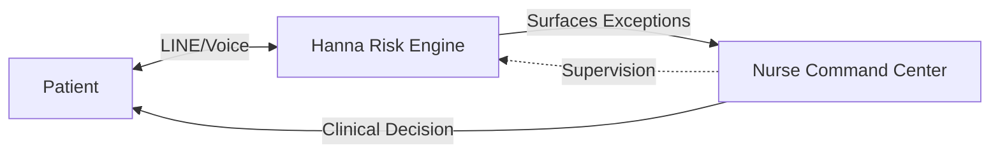

# Hanna: The Financial Risk Engine for Capitation-Based Hospitals

**Hanna continuously monitors chronic patients via LINE, predicts deterioration before it becomes a complication, and converts unmanaged diabetes risk into measurable cost avoidance.**

[]()
[]()

---

## The Problem: The 90-Day Black Hole

Under capitation (SSS/UCS), your hospital bears the financial risk for chronic patients. When a diabetic patient leaves your NCD clinic, they enter a **90-day black hole** — no data, no visibility, no intervention — until they return sicker and more expensive.

**Each preventable complication costs ฿175,000+. Hanna stops that.**

## The Solution: Continuous Risk Monitoring

Hanna closes the gap between clinic visits by:
1.  **Monitoring daily** via LINE: Automated check-ins for vitals, meds, and symptoms.
2.  **Detecting deterioration early**: OneBrain™ engine scores risk and flags patients before they become expensive.
3.  **Surfacing exceptions**: Nurses see only the patients who need intervention — not the ones who are fine.

> **"We don't just follow up. We predict complications before they happen."**

---

## Core Capabilities

### 1. Daily Patient Monitoring (LINE + Voice)
- **LINE Bot**: Structured daily check-ins for vitals and medication adherence.
- **Thai Voice AI**: Voice-first check-ins for elderly patients.
- **100% Reach**: Patients respond on an app they already use, 24/7.

### 2. OneBrain™ Risk Engine
- **Risk Scoring**: Real-time 0-10 risk score for every patient.
- **Deterioration Detection**: Flags worsening trends before they become complications.
- **Clinical Safeguards**: Rule-based escalation with zero autonomous clinical decisions.

### 3. Nurse Command Center
- **Triage Queue**: Prioritized list of who needs a call *right now*.
- **Risk Distribution**: Real-time view of cohort health and financial exposure.
- **One-Click Action**: Efficient workflow to close loops fast.

---

## Architecture: Human-in-the-Loop



Hanna acts as the **financial protection layer** between the patient and the clinical team.

---

## Deployment

### Prerequisites
- Node.js 18+
- PostgreSQL (Supabase)
- LINE Official Account
- Groq API Key (Llama 3.3)
- LiveKit Cloud (for Voice)

### Quick Start
```bash
# Clone repository
git clone https://github.com/farhaned07/hanna-line-bot.git

# Install dependencies
npm install

# Configure environment
cp .env.example .env

# Run locally
npm start
```

---

## Documentation

- [**Product Canon**](./docs/PRODUCT_CANON.md) - The single source of truth.
- [**Architecture**](./ARCHITECTURE.md) - Technical system design.
- [**Regulatory Posture**](./docs/REGULATORY_POSTURE.md) - Legal & safety framework.

---

**Built for Capitation. Powered by Supervised AI.**
