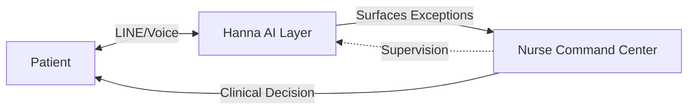

# Hanna: 10x Nurse Capacity through Supervised AI

**Hanna is the supervised care assistant that lets one nurse safely manage 500+ chronic patients.**

[]()
[]()

---

## The Problem: The Nurse Shortage

Thailand faces a shortage of **35,000 nurses**. Hospitals cannot hire their way out of this crisis. The result is burnout, missed follow-ups, and readmissions.

## The Solution: Nurse Force Multiplication

Hanna gives each nurse **10x capacity** by:
1.  **Handling Routine Follow-up**: Automated daily check-ins for vitals, meds, and symptoms via LINE & Voice.
2.  **Surfacing Exceptions**: OneBrain™ engine detects risks and prioritizes them for human review.
3.  **Supervised Control**: Nurses oversee everything through the Command Center. AI never makes clinical decisions alone.

> **"We don't replace nurses. We give them superpowers."**

---

## Core Capabilities

### 1. Automated Patient Coverage (The "Eyes")
- **LINE Bot**: Daily health logging and medication reminders.
- **Gemini Live Voice**: Thai-speaking voice assistant for elderly friendly check-ins.
- **100% Reach**: Reaches patients where they are, 24/7.

### 2. OneBrain™ Intelligence (The "Brain")
- **Risk Scoring**: Real-time 0-10 risk score for every patient.
- **Exception Detection**: Flags "Red" (Critical) and "Amber" (Drifting) patients.
- **Safeguards**: Clinical caps and rule-based escalation.

### 3. Nurse Command Center (the "Hands")
- **Triage Queue**: Prioritized list of who needs a call *right now*.
- **Capacity Meter**: Real-time view of nurse bandwidth and patient load.
- **One-Click Action**: Efficient workflow to close loops fast.

---

## Architecture: Human-in-the-Loop



Hanna acts as the **infrastructure layer** between the patient and the clinical team.

---

## Deployment

### Prerequisites
- Node.js 18+
- PostgreSQL (Supabase)
- LINE Official Account
- Groq API Key (Llama 3.3)
- LiveKit Cloud (for Voice)

### Quick Start
```bash
# Clone repository
git clone https://github.com/farhaned07/hanna-line-bot.git

# Install dependencies
npm install

# Configure environment
cp .env.example .env

# Run locally
npm start
```

---

## Documentation

- [**Product Canon**](./docs/PRODUCT_CANON.md) - The single source of truth.
- [**Architecture**](./ARCHITECTURE.md) - Technical system design.
- [**Regulatory Posture**](./docs/REGULATORY_POSTURE.md) - Legal & safety framework.

---

**Built for Hospitals. Powered by Supervised AI.**

